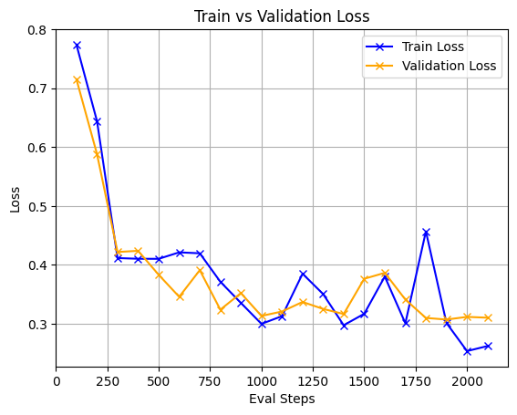

# PEFT Project Template with Hugging Face

This project demonstrates how to use the Hugging Face `peft` library for parameter-efficient fine-tuning (PEFT) of a pre-trained model. Here, we fine-tune a GPT-2 model with LoRA (Low-Rank Adaptation) for a text classification task (e.g., sentiment analysis on the Rotten Tomatoes dataset). This approach reduces the number of trainable parameters, making fine-tuning faster and more memory-efficient.

## Table of Contents
- [Features](#features)
- [Requirements](#requirements)
- [Installation](#installation)
- [Dataset](#dataset)
- [Usage](#usage)
- [Training](#training)
- [Evaluation](#evaluation)
- [Results](#results)
- [Contributing](#contributing)
- [License](#license)

## Features
- Fine-tune GPT-2 with LoRA using the `peft` library.
- Efficient training with minimal GPU memory usage.
- Customizable `TrainingArguments` for flexible experimentation.
- Checkpoint saving and best model loading based on accuracy.

## Requirements
- Python 3.8+
- PyTorch
- Hugging Face `transformers` library
- Hugging Face `peft` library
- Hugging Face `datasets` library
- NumPy

## Installation
1. Clone this repository:
   ```bash
   git clone https://github.com/yourusername/peft-project.git
   cd peft-project
   ```
2. Install dependencies:
   ```bash
   pip install -r requirements.txt
   ```

## Dataset
This project uses the Rotten Tomatoes dataset for sentiment classification (positive/negative reviews). You can load it via the `datasets` library:
```python
from datasets import load_dataset
dataset = load_dataset("cornell-movie-review-data/rotten_tomatoes")
```

- **Train**: ~8,500 samples
- **Validation**: ~1,000 samples
- **Test**: ~1,000 samples

## Usage
1. Prepare your environment and dataset.
2. Configure the model, PEFT settings, and training arguments (see `train.py` or below).
3. Run the training script.

### Example Script
```python
from transformers import GPT2ForSequenceClassification, TrainingArguments, Trainer
from peft import LoraConfig, get_peft_model
from datasets import load_dataset

# Load dataset
dataset = load_dataset("cornell-movie-review-data/rotten_tomatoes")

# Load model
model = GPT2ForSequenceClassification.from_pretrained("gpt2", num_labels=2)

# Configure LoRA
lora_config = LoraConfig(
    r=8,  # Rank of the adaptation matrices
    lora_alpha=16,  # Scaling factor
    target_modules=["attn.c_attn"],  # Modules to apply LoRA to
    lora_dropout=0.1,  # Dropout for LoRA layers
    bias="none",  # Bias handling
    task_type="SEQ_CLS"  # Sequence classification task
)
model = get_peft_model(model, lora_config)

# Define metrics
def compute_metrics(eval_pred):
    logits, labels = eval_pred
    predictions = np.argmax(logits, axis=-1)
    return {"accuracy": (predictions == labels).mean()}

# Training arguments
training_args = TrainingArguments(
    # Checkpoint Saving Settings
    output_dir="./results",
    overwrite_output_dir=True,  # Overwrites the output directory if it already exists, avoiding conflicts.

    # Dataset labels
    label_names = ['labels'],

    # Training Epoch and Batch Settings
    num_train_epochs=2,  # Runs training for 3 full passes over the dataset.
    per_device_train_batch_size=8,  # Uses a batch size of 8 per device (e.g., GPU/CPU) during training.
    per_device_eval_batch_size=8,  # Sets evaluation batch size to 8, matching training for consistency.

    # Evaluation Configuration
    eval_strategy="steps",  # Evaluates the model at regular step intervals rather than epoch ends.
    eval_steps=100,  # Performs evaluation every 100 training steps.
    eval_delay=100,  # Delays the first evaluation until after 100 steps, allowing initial training to stabilize.
    

    # Model Checkpoint Saving Options
    save_strategy="steps",  # Saves checkpoints based on steps, aligning with evaluation strategy.
    save_steps=100,  # Saves a checkpoint every 100 steps, syncing with evaluation for easy rollback.
    save_safetensors=True,  # Uses safetensors format for safer, faster, and more efficient model storage.
    save_total_limit=2,  # Keeps only the 2 most recent checkpoints to manage disk space.

    # Optimizer Hyperparameters
    learning_rate=2e-4,  # Sets a moderate learning rate (0.0002) suitable for fine-tuning tasks like LoRA.
    weight_decay=0.01,  # Applies a small weight decay to prevent overfitting by regularizing weights.

    # Logging Configuration
    logging_dir="./logs",  # Stores training logs in a dedicated directory for analysis.
    logging_steps=10,  # Logs metrics every 10 steps, providing frequent updates on training progress.
    logging_strategy="steps",  # Logs based on step intervals, consistent with evaluation and saving.

    # Model Selection and Reporting
    load_best_model_at_end=True,  # Loads the best-performing model (based on metric) at the end of training.
    metric_for_best_model="accuracy",  # Uses accuracy as the criterion to determine the "best" model.
    report_to="none",  # Disables external reporting (e.g., TensorBoard, WandB) for simplicity or local use.
)

# Initialize Trainer
trainer = Trainer(
    model=model,
    args=training_args,
    train_dataset=dataset["train"],
    eval_dataset=dataset["validation"],
    compute_metrics=compute_metrics
)

# Train
trainer.train()
```

## Training
To train the model:
```bash
python train.py
```
- Checkpoints are saved in `./results` every 100 steps.
- Logs are written every 10 steps for monitoring.

## Evaluation
Evaluate the model on the test set:
```python
trainer.evaluate(dataset["test"])
```
The `compute_metrics` function reports accuracy.

## Results
(Replace this with your actual results after training)
- **Best Accuracy**: 86.30% (on validation set)
- **Test Accuracy**: 86.30%
- **Training Time**: ~10 mins on a single GPU (e.g., T4)



## Contributing
Contributions are welcome! Please:
1. Fork the repository.
2. Create a feature branch (`git checkout -b feature/your-feature`).
3. Commit your changes (`git commit -m "Add your feature"`).
4. Push to the branch (`git push origin feature/your-feature`).
5. Open a pull request.

## License
This project is licensed under the MIT License. See [LICENSE](LICENSE) for details.